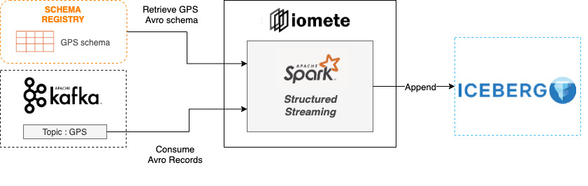

# iomete: Kafka Streaming Job

This is a collection of data movement capabilities. This streaming job copies data from Kafka to Iceberg.

Currently, two serialization format supported.
1. JSON
2. AVRO

## JSON deserialization
In the Spark configuration, a user-defined reference json schema can be defined, 
and the system processes the binary data accordingly. Otherwise, 
It considers the schema of the first row and assumes the rest of the rows is compatible.

## Avro deserialization
Converts binary data according to the schema defined by the user or retrieves the schema from the schema registry.



### Configuration example

```hocon
{
      "kafka": {
          "bootstrap_servers": "localhost:9092",
          "topic_name": "test-json",
          "serialization_format": "json",
          "starting_offsets": "latest",
          "trigger": {
            "interval": "5"
            "unit": "seconds" # minutes
          },
          "schema_registry_url": "http://127.0.0.1:8081" # for avro topics
      },
      "database": {
        "table_name": "spark_usage"
      }
}
```

## Development

**Prepare the dev environment**

```shell
virtualenv .env #or python3 -m venv .env
source .env/bin/activate

pip install -e ."[dev]"
```

**Run test**

```shell
pytest
```
